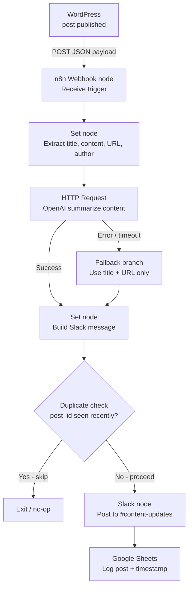

# Part B — Automation sketch

## The goal in one sentence
When a new WordPress post is published, automatically send a short AI-generated summary to a designated Slack channel so the whole team is notified without manually checking the CMS.

## Tool I picked + 2-line justification
**n8n (self-hosted or cloud)**
n8n has native WordPress and Slack nodes, supports webhook triggers out of the box, and — unlike Zapier — allows custom logic (e.g. calling an LLM to generate the summary) without hitting task limits on a free plan. The self-hosted option also keeps editorial content off third-party servers, which matters for client work.

## Trigger
WordPress fires an outgoing webhook on `post_published` status transition, via the **WP Webhooks** plugin (free). The plugin sends a POST request with the full post payload (title, content, URL, author) to n8n's webhook receiver URL the moment a post goes live — no polling delay.

## Steps (numbered)

1. **Receive webhook** — n8n's Webhook node listens on a unique URL (e.g. `https://n8n.youragency.com/webhook/wp-new-post`). WordPress POSTs the new post's JSON payload here on publish.
2. **Extract fields** — A Set node pulls `post_title`, `post_content` (stripped of HTML), `post_url`, and `post_author` from the incoming payload for use downstream.
3. **Generate summary** — An HTTP Request node calls the OpenAI Chat Completions API with the stripped post content. Prompt: *"Summarize this blog post in 2–3 sentences for a Slack message. Be specific, not generic."* Returns a short summary string.
4. **Build Slack message** — A Set node assembles the final message: `*New post by [author]:* [title]\n[summary]\n[url]`
5. **Post to Slack** — n8n's Slack node posts the assembled message to the `#content-updates` channel using a Slack bot token. Message is posted as a Bot, not a user.
6. **Log result** — Optionally write a row to a Google Sheet (post title, timestamp, Slack message sent: yes/no) for a lightweight audit trail.

## 2 failure modes I would handle

1. **Failure:** The OpenAI API is down or rate-limited, causing step 3 to error out and the whole workflow to fail silently — the team gets no Slack message.
   **Handling:** Wrap the HTTP Request node in an n8n error branch. If the AI call fails, fall back to sending the Slack message with just the post title and URL (no AI summary), and append `[summary unavailable]` so the team knows. The post notification still goes out.

2. **Failure:** WordPress fires the webhook multiple times for the same post (e.g. autosave triggers or duplicate plugin events), causing duplicate Slack messages.
   **Handling:** Before posting to Slack, check the incoming `post_id` against a small lookup in n8n's static data store (or a Redis node). If the ID was already processed in the last 10 minutes, skip and exit the workflow. This deduplicates without needing an external database.

## Diagram

---

## Part C — A repetitive task I would automate

**Task:** Every Monday morning, an account manager at a marketing agency manually visits each client's Google Analytics 4 property, screenshots or copy-pastes the weekly session/conversion numbers into a Google Sheet, then writes a brief summary email to each client.

**Why it is repetitive:** It happens every single Monday for every active client (typically 5–15 accounts). The account manager spends 60–90 minutes on data collection alone before writing a single word of analysis — pure mechanical work repeated weekly by a mid-senior person.

**Tool:** n8n, connected to the GA4 Data API and Gmail (or an email node).

**Trigger and action:** Every Monday at 08:00 via a Cron node, n8n calls the GA4 Data API for each client property, writes the metrics to a Google Sheet, generates a 3-sentence plain-English summary via OpenAI, and sends a pre-populated draft email to the account manager's Gmail drafts folder — ready to review and send in 2 minutes instead of 90.

**Biggest failure mode:** A client's GA4 service account token expires or loses API access mid-run — the automation silently skips that client's report. Mitigation: after each API call, check for a non-200 response and immediately Slack the account manager with the specific client name and error code, so no client is missed without a human being aware.